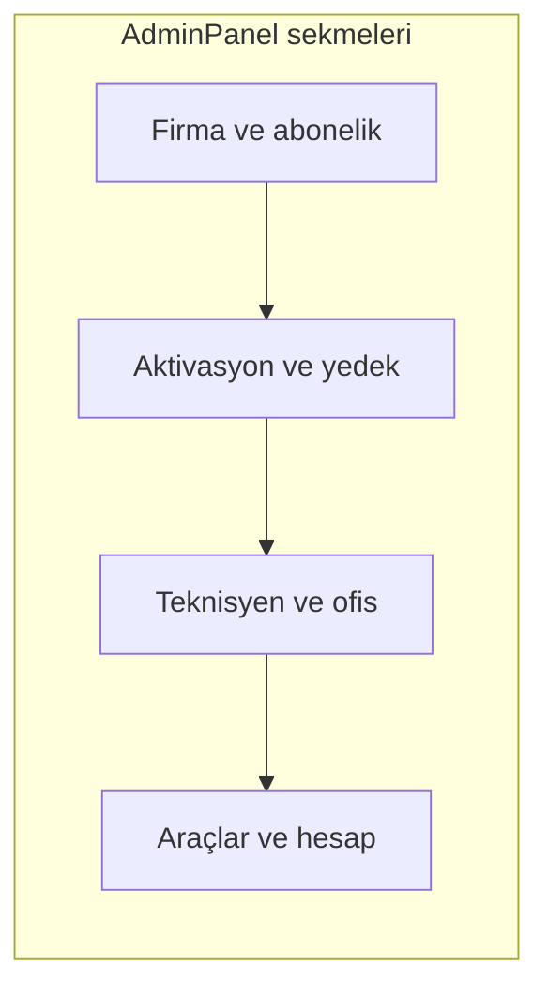

# Yönetici paneli arayüzünü sadeleştirme

## Kapsam

- Hedef: Next.js web uygulamasındaki yönetici görünümü ([`proservis-web/src/components/admin/AdminPanel.tsx`](proservis-web/src/components/admin/AdminPanel.tsx)), [`dashboard/page.tsx`](proservis-web/src/app/dashboard/page.tsx) içinde `isAdmin` iken render ediliyor.
- Masaüstü Qt arayüzü (`ui/main_window.py` vb.) bu planda **yok**; isterseniz ayrıca ele alınabilir.

## Mevcut durum (kısa)

- Üstte başlık + dört eylem (Veri Export/Import, Uyumluluk Katalogu, **Tanrı Modu**, Yenile).
- Ardından sırayla: firma seç/oluştur, üç özet kart, firma bilgisi + abonelik, aktivasyon key tablosu, yedek, teknisyenler (yoğun `md:grid-cols-7` form), ofis kullanıcıları (izinlerde ham İngilizce anahtarlar: `dashboard`, `financial-reports`…), yönetici şifresi + uzun `Textarea` uyarısı.

## Önerilen değişiklikler

### 1. Sekmeli yapı (Radix Tabs)

Projede hazır bileşen: [`proservis-web/src/components/ui/tabs.tsx`](proservis-web/src/components/ui/tabs.tsx). `AdminPanel` dönüş değerinde kartları mantıksal gruplara ayırın; örnek sekme isimleri (Türkçe, kısa):

| Sekme | İçerik |
|--------|--------|
| **Genel** | Firma seçimi/oluşturma, üç özet kart, firma bilgileri + abonelik kaydı |
| **Lisans** | Aktivasyon key geçmişi + (isteğe bağlı) firma yedeği (aynı “veri yaşam döngüsü” teması) |
| **Kullanıcılar** | Teknisyenler + firma kullanıcıları (ofis) |
| **Hesap ve araçlar** | Üstteki diyalog tetikleyicileri (veya buraya taşınmış butonlar), yönetici şifre değiştir |

Üst başlık satırı: başlık + **Yenile** kalabilir; diyalogları “Hesap ve araçlar” sekmesine taşımak üst çubuğu sadeleştirir ve “gelişmiş” işleri tek yerde toplar (Tanrı Modu gibi yıkıcı eylemler yine `destructive` ile ayrışır).

### 2. Kart başlıklarına bağlam: `CardDescription`

[`proservis-web/src/components/ui/card.tsx`](proservis-web/src/components/ui/card.tsx) içinde `CardDescription` export ediliyor; her `CardHeader` içinde 1 satırlık Türkçe açıklama (ör. abonelik kartında: “Seçili firmaya ait iletişim ve abonelik alanlarını günceller; kaydetmeden çıkmayın.”).

### 3. Firma seçilmediğinde net geri bildirim

`selectedTenantId` boşken: sekme içeriğinde üstte sarı/amber çerçeveli kısa uyarı (mevcut `Alert` bileşeni yok; sınıflarla `border-l-4` + `bg-amber-50` yeterli). Abonelik / kullanıcı / lisans bölümlerinde işlem butonlarını devre dışı bırakma veya sadece uyarı gösterme tutarlı olsun.

### 4. İzin onay kutuları: Türkçe görünen isimler

[`proservis-web/src/lib/modulePermissions.ts`](proservis-web/src/lib/modulePermissions.ts) içinde `TENANT_PERMISSION_KEYS` sabit; burada veya aynı dosyada `Record<TenantModulePermissionKey, string>` bir `TENANT_PERMISSION_LABELS_TR` haritası tanımlayıp `AdminPanel` içinde checkbox yanında `key` yerine bu etiketleri gösterin (ör. `financial-reports` → “Finansal raporlar”). Anahtarlar Firestore’da değişmez; sadece UI metni değişir.

### 5. Teknisyen formu yerleşimi

`md:grid-cols-7` tek satırda çok sıkışıyor. Aynı alanlar korunarak iki satırlık ızgara (ör. üst satır: ad, e-posta, telefon, kimlik; alt satır: şifre, global ID, eylem butonları) veya “Gelişmiş” için `globalTechnicianId` alanını ikinci satıra almak okunabilirliği artırır.

### 6. Yönetici şifre bölümündeki `Textarea`

Uzun salt-okunur not yerine: kısa `CardDescription` veya tek paragraf `text-sm text-muted-foreground` (güvenlik uyarısı korunur, görsel gürültü azalır).

### 7. (İsteğe bağlı) Tanrı Modu buton metni

[`AdminGodModeDialog.tsx`](proservis-web/src/components/admin/AdminGodModeDialog.tsx) tetikleyici metnini daha açıklayıcı yapın (ör. “Toplu veri ve geri alma”) — davranış aynı kalır; yalnızca kullanıcı ne açacağını anlar.

## Teknik not

- State ve handler’lar `AdminPanel` içinde kalabilir; sadece JSX yeniden gruplanır. İsterseniz okunurluk için sekmelere özel küçük alt bileşenler (`AdminPanelTenantTab.tsx` vb.) ayrılabilir; zorunlu değil.
- İş mantığına dokunulmaz; Firestore çağrıları ve mevcut `alert` akışları aynı kalır.

