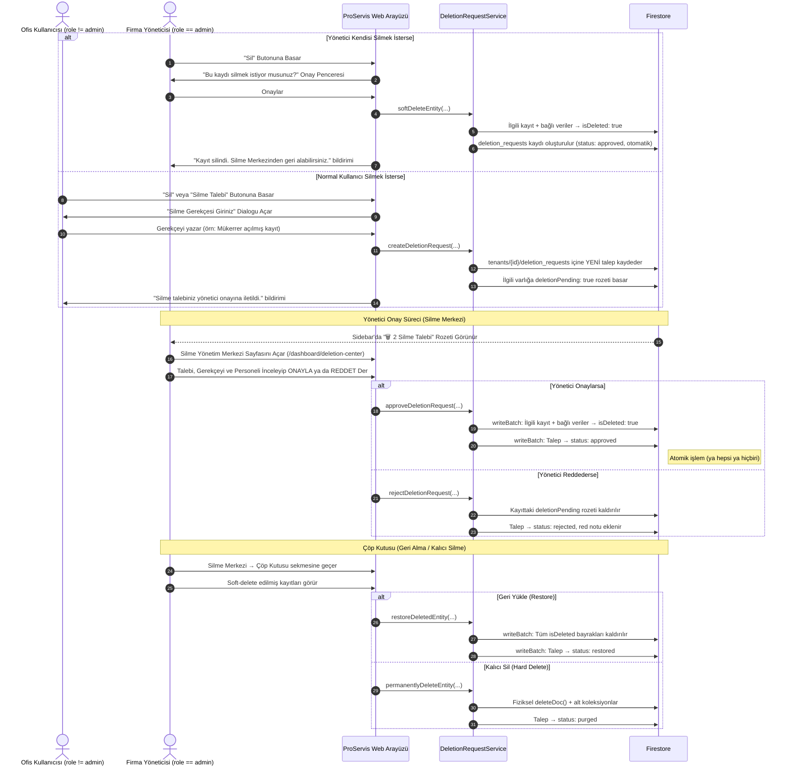

# ProServis Silme İşlemleri Yönetici Onay Mekanizması (v2)
## Dört Göz (Maker-Checker), Soft-Delete ve Geri Alma Mimari Planı

> **Doküman Türü:** Güvenlik ve Süreç İyileştirme RFC'si (Enterprise Workflow & Security Plan)  
> **Tarih:** 1 Ekim 2026  
> **Durum:** Planlama Tamamlandı / Uygulama Bekliyor  
> **Versiyon:** 2.0 (Senior Review sonrası güncellenmiş)  
> **Kapsam:** `proservis-web` tüm CRUD sayfaları (Müşteri, Cihaz, Servis, Stok, Fatura, Şube vb.)  
> **Amaç:** Yönetici harici hiçbir kullanıcının doğrudan silme yapamaması; silme işlemlerinin yumuşak (soft-delete) yapılması; yöneticinin ayrı bir onay sayfasından talepleri yönetmesi ve istediği zaman geri alabilmesi.

---

## 1. Neden Bu Mekanizma Gereklidir? (İş Mantığı ve Risk Analizi)

1. **İstem Dışı / Kötü Niyetli Veri Kaybını Önleme:**
   - Saha personeli, ofis çalışanları veya stajyerler yanlışlıkla ya da yetkisizce kritik müşteri kartlarını, geçmiş servis kayıtlarını veya faturaları kalıcı olarak silebilir.
2. **Denetim İzi (Audit Trail & Accountability):**
   - Kim, hangi kaydı, ne zaman ve hangi gerekçeyle silmek istedi? Yönetici neden onayladı veya reddetti? Sorularına kurumsal yanıt verir.
3. **Geri Alma Garantisi (Undo / Restore):**
   - Yönetici bile yanlış silme yapabilir. Soft-delete mimarisi sayesinde veriler hiçbir zaman kaybolmaz; istendiğinde tam geri yüklenir.
4. **Kurumsal SaaS Standartı (Four-Eyes Principle / Maker-Checker):**
   - Finans, bankacılık ve kurumsal ERP sistemlerinde kritik silme işlemleri tek bir kişinin inisiyatifine bırakılmaz.

---

## 2. Üç Katmanlı Silme Mimarisi

### 2.1 Neden "Seçici Silme" Yerine "Soft-Delete"?

**Seçici silme** (müşteriyi sil ama faturalarını tut) kulağa esnek gelir ancak **veri bütünlüğünü bozar:**
- Faturadaki `customerId` artık var olmayan bir müşteriye işaret eder → **orphaned data**
- Servis kaydındaki `deviceId` silinmiş bir cihaza bakar → **kırık referanslar**
- Finansal raporlar müşterisiz faturaları hesaplarken **hatalı sonuçlar** üretir

**Doğru çözüm:** Her şey birlikte yumuşak silinir (soft-delete), her şey birlikte geri getirilir (restore). Veri bütünlüğü hiçbir zaman bozulmaz.

### 2.2 Üç Katman Özeti

```
┌─────────────────────────────────────────────────────────────────┐
│  KATMAN 1: Silme Talebi (Normal Kullanıcı)                     │
│  ─────────────────────────────────────────                      │
│  • Personel "Sil" butonuna basar                                │
│  • Zorunlu gerekçe girer                                        │
│  • Talep → deletion_requests koleksiyonuna yazılır              │
│  • Kayıt üzerine deletionPending: true rozeti basılır           │
│  • VERİ SİLİNMEZ — sadece talep oluşur                         │
├─────────────────────────────────────────────────────────────────┤
│  KATMAN 2: Yönetici Onay / Red (Silme Yönetim Merkezi)         │
│  ─────────────────────────────────────────                      │
│  • Yönetici /dashboard/deletion-center sayfasını açar           │
│  • Bekleyen talepleri inceler                                   │
│  • [ONAYLA] → Kayıt ve ilişkili veriler SOFT-DELETE yapılır     │
│  • [REDDET] → Talep reddedilir, kayda dokunulmaz               │
│  • Yönetici kendi silmek isterse → Doğrudan SOFT-DELETE         │
├─────────────────────────────────────────────────────────────────┤
│  KATMAN 3: Geri Alma / Kalıcı Silme (Çöp Kutusu)               │
│  ─────────────────────────────────────────                      │
│  • Soft-delete edilen tüm veriler "Çöp Kutusu" sekmesinde      │
│  • Yönetici isterse [GERİ YÜKLE] → Her şey eski haline döner   │
│  • Yönetici isterse [KALICI SİL] → Fiziksel hard-delete         │
│  • Opsiyonel: 90 gün sonra otomatik kalıcı silme               │
└─────────────────────────────────────────────────────────────────┘
```

---

## 3. Onay Akış Mimarisi (Workflow Architecture)



---

## 4. Veri Modeli

### 4.1 Silme Talep Kaydı (`tenants/{tenantId}/deletion_requests`)

```typescript
export type DeletionEntityType = 
    | 'customer'         // Müşteri Kartı
    | 'customer_device'  // Müşteri Cihazı
    | 'contract'         // Sözleşme
    | 'service_record'   // Servis Kaydı
    | 'stock_item'       // Stok Kartı
    | 'stock_transfer'   // Stok Transferi
    | 'invoice'          // Fatura
    | 'operating_expense'// Gider Fişi
    | 'branch'           // Şube
    | 'warehouse'        // Depo
    | 'technician'       // Teknisyen
    | 'user'             // Alt Kullanıcı
    | 'potential_customer'// Potansiyel Müşteri
    | 'other';

export type DeletionRequestStatus = 
    | 'pending'    // Onay bekliyor (personel talep etti)
    | 'approved'   // Onaylandı ve soft-delete yapıldı
    | 'rejected'   // Yönetici reddetti
    | 'cancelled'  // Personel talebi geri çekti
    | 'restored'   // Yönetici geri yükledi (soft-delete geri alındı)
    | 'purged';    // Kalıcı olarak silindi (hard-delete)

export interface DeletionRequest {
    id: string;
    tenantId: string;
    
    // ── Silinmek İstenen Varlık ──
    entityType: DeletionEntityType;
    entityId: string;
    entityTitle: string;           // Örn: "ABC Teknoloji A.Ş." veya "Servis #1042"
    entityPath: string;            // Firestore path: "tenants/xxx/customers/yyy"
    
    // ── İlişkili Veriler (Soft-delete sırasında ne etkilendi?) ──
    affectedEntities?: {
        type: string;              // "devices", "service_records", "invoices" vb.
        count: number;             // Etkilenen kayıt sayısı
        label: string;             // "5 Cihaz", "12 Servis Kaydı" vb.
        docIds: string[];          // Etkilenen doküman ID'leri (geri yükleme için)
    }[];
    
    // ── Talep Eden ──
    requestedByUid: string;
    requestedByName: string;
    requestedByEmail: string;
    requestedAt: any;              // Firestore Timestamp
    reason: string;                // Zorunlu silme gerekçesi
    
    // ── Karar Veren Yönetici ──
    status: DeletionRequestStatus;
    reviewedByUid?: string;
    reviewedByName?: string;
    reviewedAt?: any;
    reviewNote?: string;           // Yönetici onay veya red notu
    
    // ── Soft-Delete Bilgileri ──
    softDeletedAt?: any;           // Ne zaman soft-delete yapıldı
    restoredAt?: any;              // Ne zaman geri yüklendi
    purgedAt?: any;                // Ne zaman kalıcı silindi
}
```

### 4.2 Soft-Delete Bayrakları (Mevcut Dokümanlar Üzerine)

Silinen her dokümana eklenen alanlar:
```typescript
{
    isDeleted: true,                    // Ana filtre bayrağı
    deletedAt: Timestamp,               // Silinme zamanı
    deletedByUid: string,               // Kim sildi veya kim onayladı
    deletedByName: string,              // Silen kişinin adı
    deletionRequestId: string,          // Hangi talep ile silindi
    deletionPending?: boolean,          // Personel talep etti ama henüz onaylanmadı
}
```

### 4.3 Mevcut Sorguların Güncellenmesi

Tüm liste sorgularına `isDeleted` filtresi eklenir. Firestore'da `isDeleted` alanı olmayan dokümanlar (mevcut tüm veriler) bu filtreyi otomatik geçer, yani **geriye dönük uyumluluk korunur.** İstemci tarafında `.filter(d => !d.isDeleted)` ile filtreleme yapılır.

---

## 5. Evrensel ve Tak-Çalıştır İstemci Mimarisi

### 5.1 Evrensel Hook: `useDeletionAction`

```typescript
// Hook dönüş değeri:
const { 
    requestOrExecuteDelete,  // Ana fonksiyon: role göre talep veya silme
    DeletionDialog,          // JSX — sayfaya {DeletionDialog} olarak eklenir
    isPending                // Bu kayıt için bekleyen talep var mı
} = useDeletionAction({ tenantId, tenantAccess });

// Örnek Kullanım (herhangi bir sayfada):
const handleDeleteCustomer = (customer: Customer) => {
    requestOrExecuteDelete({
        entityType: 'customer',
        entityId: customer.id,
        entityTitle: `${customer.name} (Müşteri)`,
        entityPath: `tenants/${tenantId}/customers/${customer.id}`,
        onSoftDelete: async () => {
            await DeletionRequestService.softDeleteCustomer(tenantId, customer.id, {
                deletedByUid: tenantAccess.userId,
                deletedByName: tenantAccess.userEmail,
            });
        },
        dependencyWarning: deviceCount > 0 
            ? `Bu müşteriye bağlı ${deviceCount} cihaz, ${serviceCount} servis kaydı da silinecektir.`
            : undefined,
    });
};
```

### 5.2 Mantık Akışı

Hook, `useTenantUserAccess` hook'unu kullanarak mevcut oturumun rolünü kontrol eder:

**`role === 'admin'` (Yönetici):**
1. Onay penceresi açılır: "Bu kaydı silmek istiyor musunuz? İlişkili X cihaz, Y servis kaydı da silinecektir."
2. Yönetici onaylarsa → `onSoftDelete()` çalışır → Kayıt ve bağımlıları soft-delete yapılır
3. Silme Merkezi'nden geri alınabilir

**`role !== 'admin'` (Normal Personel):**
1. "Silme Talebi İlet" modali açılır
2. Zorunlu gerekçe (`reason`) istenir
3. `deletion_requests` koleksiyonuna talep yazılır
4. Kayıt üzerine `deletionPending: true` rozeti basılır
5. Personele "Talebiniz yönetici onayına iletildi" bildirimi gösterilir

---

## 6. Silme Yönetim Merkezi (Ayrı Sayfa: `/dashboard/deletion-center`)

### 6.1 Sayfa Yapısı

Bu sayfa **sadece yöneticilere** (`role === 'admin'`) görünür ve sidebar menüsünde kendi ikonu ile yer alır.

**Üç sekme içerir:**

#### Sekme 1: Bekleyen Talepler (Onay Kuyruğu)
Personelin gönderdiği ve henüz karar verilmemiş talepler:

| Tarih | Talep Eden | Silinecek Kayıt | Tür | Gerekçe | Aksiyonlar |
|-------|-----------|-----------------|-----|---------|------------|
| 01.10.2026 14:30 | Ahmet Yılmaz | ABC Teknoloji A.Ş. | Müşteri | "Mükerrer kayıt" | Onayla / Reddet |
| 01.10.2026 15:45 | Mehmet Demir | Servis #1042 | Servis Kaydı | "Test kaydı" | Onayla / Reddet |

- **[Onayla ve Sil]:** Yönetici onaylar → Soft-delete yapılır → Çöp kutusuna düşer
- **[Reddet]:** Yönetici red sebebi girer → Talep reddedilir → `deletionPending` rozeti kaldırılır

#### Sekme 2: Çöp Kutusu (Soft-Delete Edilenler)
Soft-delete yapılmış tüm kayıtlar (hem yöneticinin doğrudan sildikleri, hem onaylanmış talepler):

| Silinme Tarihi | Kayıt Adı | Tür | Kim Sildi | Etkilenen | Aksiyonlar |
|----------------|-----------|-----|-----------|-----------|------------|
| 01.10.2026 14:35 | ABC Teknoloji A.Ş. | Müşteri | Yönetici (onay) | 5 Cihaz, 3 Servis | Geri Yükle / Kalıcı Sil |
| 30.09.2026 10:20 | TK-1234 Toner | Stok | Yönetici (direkt) | — | Geri Yükle / Kalıcı Sil |

- **[Geri Yükle]:** Kayıt ve TÜM ilişkili veriler geri getirilir (isDeleted bayrakları kaldırılır)
- **[Kalıcı Sil]:** Fiziksel hard-delete yapılır (geri dönüşü olmaz — ek onay penceresi ile)

#### Sekme 3: Geçmiş (Tüm İşlem Kayıtları)
Tüm silme taleplerinin kronolojik geçmişi (onaylanan, reddedilen, geri yüklenen, kalıcı silinen):

| Tarih | Kayıt | Talep Eden | Karar | Karar Veren | Not |
|-------|-------|-----------|-------|-------------|-----|
| 01.10.2026 | ABC Tek. | Ahmet Y. | Onaylandı | Ümit S. | — |
| 30.09.2026 | XYZ Ltd. | Mehmet D. | Reddedildi | Ümit S. | "Bu müşterinin aktif sözleşmesi var" |

### 6.2 Bildirim Rozeti (Sidebar)

Sidebar menüsünde "Silme Merkezi" menü öğesinin yanında bekleyen talep sayısı gösterilir:
```
🗑️ Silme Merkezi  [3]     ← Kırmızı/turuncu sayaç rozeti
```

---

## 7. Soft-Delete Teknik Detayları

### 7.1 Müşteri Silme Örneği (En Karmaşık Senaryo)

```typescript
async softDeleteCustomer(tenantId: string, customerId: string, deletedBy: {...}): Promise<AffectedEntity[]> {
    const batch = writeBatch(db);
    const affected: AffectedEntity[] = [];
    const softDeleteFields = {
        isDeleted: true,
        deletedAt: serverTimestamp(),
        deletedByUid: deletedBy.uid,
        deletionRequestId: deletedBy.requestId,
    };
    
    // 1. Müşteri dokümanı
    batch.update(doc(db, `tenants/${tenantId}/customers/${customerId}`), softDeleteFields);
    
    // 2. Alt koleksiyonlar: devices, locations, contracts
    // Her birini soft-delete et ve sayısını tut
    
    // 3. Root koleksiyonlardaki ilişkili veriler:
    //    invoices, service_records, service_requests, 
    //    customer_requests, meter_readings, contracts
    //    → Hepsi soft-delete (isDeleted: true)
    
    await batch.commit(); // Atomik — ya hepsi ya hiçbiri
    return affected;
}
```

### 7.2 Geri Yükleme (Restore) Örneği

```typescript
async restoreCustomer(tenantId: string, requestId: string): Promise<void> {
    // deletion_requests kaydından affectedEntities listesini oku
    // Hangi dokümanlar etkilenmişti bilgisi buradan gelir
    
    const batch = writeBatch(db);
    const restoreFields = {
        isDeleted: deleteField(),
        deletedAt: deleteField(),
        deletedByUid: deleteField(),
        deletionRequestId: deleteField(),
        deletionPending: deleteField(),
    };
    
    // Müşteri + tüm ilişkili verilerdeki soft-delete bayraklarını kaldır
    
    await batch.commit();
}
```

### 7.3 Atomiklik Garantisi

Tüm onay ve soft-delete işlemleri `writeBatch` ile atomik yapılır:
- **Onay:** Talep durumu güncelleme + Kayıt soft-delete → Tek batch
- **Red:** Talep durumu güncelleme + deletionPending rozeti kaldırma → Tek batch
- **Geri yükleme:** Talep durumu güncelleme + tüm isDeleted bayraklarının kaldırılması → Tek batch

Bu sayede yarım kalmış işlem (veri silindi ama talep güncellenmedi) riski ortadan kalkar.

---

## 8. Güvenlik

### 8.1 İstemci Tarafı (useDeletionAction Hook)

- `role !== 'admin'` → Silme butonu "Silme Talebi Gönder" olarak davranır
- `role === 'admin'` → Silme butonu doğrudan soft-delete yapar (onay pencesi ile)
- `deletionPending === true` olan kayıtlar → Silme butonu devre dışı + "Onay Bekliyor" rozeti

### 8.2 Firestore Security Rules (Opsiyonel Güçlendirme)

```javascript
// Yalnızca yönetici isDeleted alanını değiştirebilir:
function isTenantAdmin(tenantId) {
    return isSignedIn() && (
        isPlatformAdmin() ||
        get(/databases/$(database)/documents/tenants/$(tenantId)/users/$(request.auth.uid)).data.role == 'admin'
    );
}

// Kritik koleksiyonlarda delete yetkisi yalnızca yöneticiye:
match /tenants/{tenantId}/customers/{docId} {
    allow delete: if isTenantAdmin(tenantId);
    allow update: if isTenantAdmin(tenantId) 
        || !request.resource.data.diff(resource.data).affectedKeys().hasAny(['isDeleted', 'deletedAt']);
}
```

---

## 9. Uygulama Yol Haritası (Fazlar)

### Faz 1: Veri Modeli ve Servis Katmanı
- [ ] `src/types/deletionRequest.ts` — Tip tanımları
- [ ] `src/services/deletionRequestService.ts`:
  - [ ] `createDeletionRequest()` — Personel talep oluşturma
  - [ ] `cancelDeletionRequest()` — Personel talep geri çekme
  - [ ] `approveDeletionRequest()` — Yönetici onay + soft-delete (writeBatch)
  - [ ] `rejectDeletionRequest()` — Yönetici red (writeBatch)
  - [ ] `softDeleteEntity()` — Doğrudan soft-delete (yönetici için)
  - [ ] `restoreDeletedEntity()` — Geri yükleme (writeBatch)
  - [ ] `permanentlyDeleteEntity()` — Kalıcı hard-delete
  - [ ] `listPendingRequests()` — Bekleyen talepler
  - [ ] `listSoftDeletedEntities()` — Çöp kutusu
  - [ ] `listDeletionHistory()` — Geçmiş log
  - [ ] `getPendingCount()` — Sidebar rozeti için sayaç

### Faz 2: Evrensel İstemci Bileşenleri
- [ ] `src/hooks/useDeletionAction.ts` — Tek hook ile tüm sayfalara entegre
- [ ] `src/components/common/DeleteConfirmOrRequestDialog.tsx` — Admin: onay / Personel: gerekçeli form

### Faz 3: Silme Yönetim Merkezi Sayfası
- [ ] `src/app/dashboard/deletion-center/page.tsx` — Ana sayfa (3 sekmeli)
- [ ] Sekme 1: Bekleyen Talepler (onay kuyruğu)
- [ ] Sekme 2: Çöp Kutusu (soft-delete edilenler + geri yükleme)
- [ ] Sekme 3: Geçmiş (tüm işlem logları)
- [ ] Sidebar menüsüne "Silme Merkezi" eklenmesi + sayaç rozeti
- [ ] `modulePermissions.ts` e yeni izin anahtarı: `deletion_center`

### Faz 4: Mevcut Sayfalara Kademeli Entegrasyon
- [ ] Müşteriler ve Cihazlar (en karmaşık basamaklı silme)
- [ ] Servis Kayıtları
- [ ] Stok Kartları ve Depolar
- [ ] Faturalar ve Giderler
- [ ] Sözleşmeler
- [ ] Potansiyel Müşteriler
- [ ] Personel ve Maaş Kayıtları
- [ ] Şube ve Kullanıcılar

### Faz 5: Mevcut Sorguların Güncellenmesi
- [ ] Tüm servis dosyalarındaki liste sorgularına `isDeleted` filtresi eklenmesi
- [ ] Arayüzde `deletionPending` rozeti gösterimi

### Faz 6: Firestore Security Rules (Opsiyonel)
- [ ] Kritik koleksiyonlarda `delete` yetkisinin yalnızca admin'e verilmesi
- [ ] `isDeleted` alanının yalnızca admin tarafından değiştirilebilmesi

---

## 10. Özet Değerlendirme

Bu v2 mekanizma hayata geçtiğinde:
1. **Veri güvenliği en üst düzeye çıkar** — personel doğrudan hiçbir şey silemez
2. **Geri alma garantisi** — yönetici bile yanlış silerse tek tıkla geri alabilir
3. **Denetim izi** — kim, ne zaman, neden sildi/talep etti tam kayıt altında
4. **Veri bütünlüğü korunur** — soft-delete sayesinde orphaned data oluşmaz
5. **Ayrı yönetim sayfası** — tüm silme işlemleri tek merkezden kontrol edilir
6. **Mevcut koda minimum müdahale** — evrensel hook sayesinde mevcut silme butonları 2-3 satır değişiklikle entegre olur

Planlama tamamlanmış olup geliştirme gününde faz faz uygulanabilir durumdadır.
