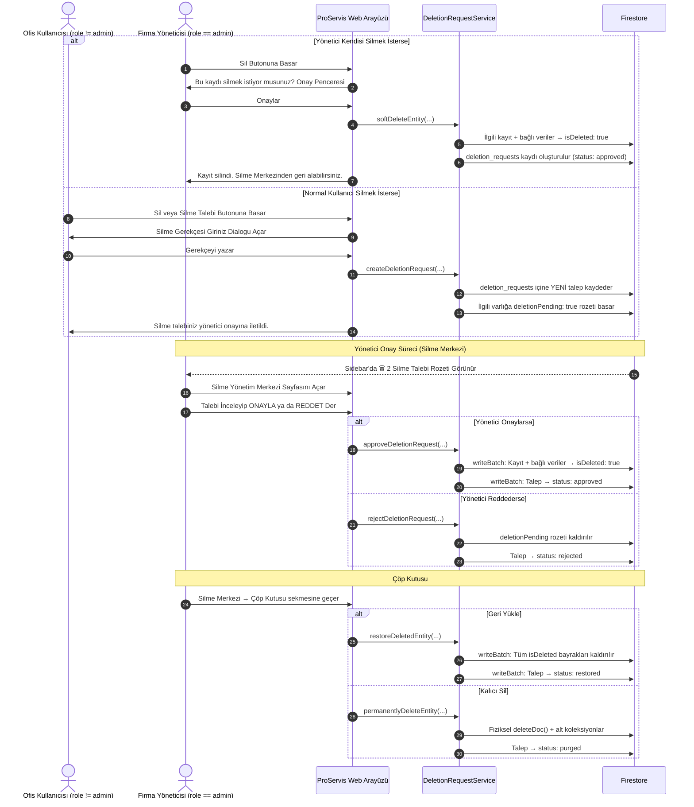

# ProServis Silme İşlemleri Yönetici Onay Mekanizması (v2)
## Dört Göz (Maker-Checker), Soft-Delete ve Geri Alma Mimari Planı

> **Doküman Türü:** Güvenlik ve Süreç İyileştirme RFC'si (Enterprise Workflow & Security Plan)  
> **Tarih:** 1 Ekim 2026  
> **Durum:** Planlama Tamamlandı / Uygulama Bekliyor  
> **Versiyon:** 2.0 (Senior Review sonrası güncellenmiş)  
> **Kapsam:** `proservis-web` tüm CRUD sayfaları (Müşteri, Cihaz, Servis, Stok, Fatura, Şube vb.)  
> **Amaç:** Yönetici harici hiçbir kullanıcının doğrudan silme yapamaması; silme işlemlerinin yumuşak (soft-delete) yapılması; yöneticinin ayrı bir onay sayfasından talepleri yönetmesi ve istediği zaman geri alabilmesi.

---

## 1. Neden Bu Mekanizma Gereklidir?

1. **İstem Dışı / Kötü Niyetli Veri Kaybını Önleme:** Saha personeli, ofis çalışanları veya stajyerler yanlışlıkla ya da yetkisizce kritik müşteri kartlarını, geçmiş servis kayıtlarını veya faturaları kalıcı olarak silebilir.
2. **Denetim İzi (Audit Trail & Accountability):** Kim, hangi kaydı, ne zaman ve hangi gerekçeyle silmek istedi? Yönetici neden onayladı veya reddetti?
3. **Geri Alma Garantisi (Undo / Restore):** Yönetici bile yanlış silme yapabilir. Soft-delete mimarisi sayesinde veriler hiçbir zaman kaybolmaz; istendiğinde tam geri yüklenir.
4. **Kurumsal SaaS Standartı (Four-Eyes Principle / Maker-Checker):** Kritik silme işlemleri tek bir kişinin inisiyatifine bırakılmaz.

---

## 2. Üç Katmanlı Silme Mimarisi

> [!IMPORTANT]
> **Neden "Seçici Silme" Yerine "Soft-Delete"?**
> Seçici silme (müşteriyi sil ama faturalarını tut) kulağa esnek gelir ancak veri bütünlüğünü bozar:
> - Faturadaki `customerId` artık var olmayan bir müşteriye işaret eder → orphaned data
> - Servis kaydındaki `deviceId` silinmiş bir cihaza bakar → kırık referanslar
> - Finansal raporlar müşterisiz faturaları hesaplarken hatalı sonuçlar üretir
>
> **Doğru çözüm:** Her şey birlikte yumuşak silinir, her şey birlikte geri getirilir. Veri bütünlüğü hiçbir zaman bozulmaz.

```
┌─────────────────────────────────────────────────────────────────┐
│  KATMAN 1: Silme Talebi (Normal Kullanıcı)                     │
│  ─────────────────────────────────────────                      │
│  • Personel "Sil" butonuna basar                                │
│  • Zorunlu gerekçe girer                                        │
│  • Talep → deletion_requests koleksiyonuna yazılır              │
│  • Kayıt üzerine deletionPending: true rozeti basılır           │
│  • VERİ SİLİNMEZ — sadece talep oluşur                         │
├─────────────────────────────────────────────────────────────────┤
│  KATMAN 2: Yönetici Onay / Red (Silme Yönetim Merkezi)         │
│  ─────────────────────────────────────────                      │
│  • Yönetici /dashboard/deletion-center sayfasını açar           │
│  • Bekleyen talepleri inceler                                   │
│  • [ONAYLA] → Kayıt ve ilişkili veriler SOFT-DELETE yapılır     │
│  • [REDDET] → Talep reddedilir, kayda dokunulmaz               │
│  • Yönetici kendi silmek isterse → Doğrudan SOFT-DELETE         │
├─────────────────────────────────────────────────────────────────┤
│  KATMAN 3: Geri Alma / Kalıcı Silme (Çöp Kutusu)               │
│  ─────────────────────────────────────────                      │
│  • Soft-delete edilen tüm veriler "Çöp Kutusu" sekmesinde      │
│  • Yönetici isterse [GERİ YÜKLE] → Her şey eski haline döner   │
│  • Yönetici isterse [KALICI SİL] → Fiziksel hard-delete         │
│  • Opsiyonel: 90 gün sonra otomatik kalıcı silme               │
└─────────────────────────────────────────────────────────────────┘
```

---

## 3. Onay Akış Mimarisi (Workflow)



---

## 4. Veri Modeli

### 4.1 Silme Talep Kaydı — `tenants/{tenantId}/deletion_requests`

```typescript
export type DeletionEntityType = 
    | 'customer'         // Müşteri Kartı
    | 'customer_device'  // Müşteri Cihazı
    | 'contract'         // Sözleşme
    | 'service_record'   // Servis Kaydı
    | 'stock_item'       // Stok Kartı
    | 'stock_transfer'   // Stok Transferi
    | 'invoice'          // Fatura
    | 'operating_expense'// Gider Fişi
    | 'branch'           // Şube
    | 'warehouse'        // Depo
    | 'technician'       // Teknisyen
    | 'user'             // Alt Kullanıcı
    | 'potential_customer'// Potansiyel Müşteri
    | 'other';

export type DeletionRequestStatus = 
    | 'pending'    // Onay bekliyor
    | 'approved'   // Onaylandı → soft-delete yapıldı
    | 'rejected'   // Reddedildi
    | 'cancelled'  // Personel geri çekti
    | 'restored'   // Geri yüklendi
    | 'purged';    // Kalıcı olarak silindi

export interface DeletionRequest {
    id: string;
    tenantId: string;
    
    // Silinmek İstenen Varlık
    entityType: DeletionEntityType;
    entityId: string;
    entityTitle: string;
    entityPath: string;
    
    // İlişkili Veriler (geri yükleme için)
    affectedEntities?: {
        type: string;       // "devices", "service_records" vb.
        count: number;
        label: string;      // "5 Cihaz", "12 Servis Kaydı"
        docIds: string[];   // Etkilenen doküman ID'leri
    }[];
    
    // Talep Eden
    requestedByUid: string;
    requestedByName: string;
    requestedByEmail: string;
    requestedAt: any;       // Firestore Timestamp
    reason: string;         // Zorunlu silme gerekçesi
    
    // Karar Veren Yönetici
    status: DeletionRequestStatus;
    reviewedByUid?: string;
    reviewedByName?: string;
    reviewedAt?: any;
    reviewNote?: string;
    
    // Zaman Damgaları
    softDeletedAt?: any;
    restoredAt?: any;
    purgedAt?: any;
}
```

### 4.2 Soft-Delete Bayrakları (Mevcut Dokümanlar Üzerine)

```typescript
{
    isDeleted: true,              // Ana filtre bayrağı
    deletedAt: Timestamp,
    deletedByUid: string,
    deletedByName: string,
    deletionRequestId: string,
    deletionPending?: boolean,    // Henüz onaylanmamış talep var
}
```

### 4.3 Mevcut Sorguların Güncellenmesi

Tüm liste sorgularında dönen sonuçlar `.filter(d => !d.isDeleted)` ile filtrelenir. `isDeleted` alanı olmayan mevcut dokümanlar bu filtreyi otomatik geçer → **geriye dönük uyumluluk korunur.**

---

## 5. Evrensel ve Tak-Çalıştır İstemci Mimarisi

### 5.1 Evrensel Hook: `useDeletionAction`

```typescript
const { 
    requestOrExecuteDelete,  // Ana fonksiyon
    DeletionDialog,          // JSX — sayfaya eklenir
    isPending                // Bekleyen talep var mı
} = useDeletionAction({ tenantId, tenantAccess });

// Herhangi bir sayfada kullanım:
const handleDeleteCustomer = (customer: Customer) => {
    requestOrExecuteDelete({
        entityType: 'customer',
        entityId: customer.id,
        entityTitle: `${customer.name} (Müşteri)`,
        entityPath: `tenants/${tenantId}/customers/${customer.id}`,
        onSoftDelete: async () => {
            await DeletionRequestService.softDeleteCustomer(
                tenantId, customer.id, { ... }
            );
        },
        dependencyWarning: `Bu müşteriye bağlı ${deviceCount} cihaz, 
            ${serviceCount} servis kaydı da silinecektir.`,
    });
};
```

### 5.2 Mantık Akışı

**Yönetici (`role === 'admin'`):**
1. Onay penceresi: "Bu kaydı silmek istiyor musunuz? İlişkili X cihaz da silinecektir."
2. Onaylarsa → `onSoftDelete()` çalışır → Soft-delete yapılır
3. Silme Merkezi'nden geri alınabilir

**Normal Personel (`role !== 'admin'`):**
1. "Silme Talebi İlet" modali açılır
2. Zorunlu gerekçe istenir
3. `deletion_requests` koleksiyonuna talep yazılır
4. Kayıt üzerine `deletionPending: true` rozeti basılır
5. "Talebiniz yönetici onayına iletildi" bildirimi

---

## 6. Silme Yönetim Merkezi — `/dashboard/deletion-center`

> [!TIP]
> Bu sayfa **sadece yöneticilere** görünür ve sidebar menüsünde kendi ikonu + bekleyen talep sayacı ile yer alır.

### Sekme 1: Bekleyen Talepler (🔔 Onay Kuyruğu)

| Tarih | Talep Eden | Silinecek Kayıt | Tür | Gerekçe | Aksiyonlar |
|-------|-----------|-----------------|-----|---------|------------|
| 01.10.2026 14:30 | Ahmet Yılmaz | ABC Teknoloji A.Ş. | Müşteri | Mükerrer kayıt | 🟢 Onayla / 🔴 Reddet |
| 01.10.2026 15:45 | Mehmet Demir | Servis #1042 | Servis Kaydı | Test kaydı | 🟢 Onayla / 🔴 Reddet |

- **Onayla:** Soft-delete yapılır → Çöp kutusuna düşer
- **Reddet:** Red sebebi girilir → `deletionPending` kaldırılır

### Sekme 2: Çöp Kutusu (♻️ Soft-Delete Edilenler)

| Silinme Tarihi | Kayıt Adı | Tür | Kim Sildi | Etkilenen | Aksiyonlar |
|----------------|-----------|-----|-----------|-----------|------------|
| 01.10.2026 | ABC Teknoloji | Müşteri | Yönetici (onay) | 5 Cihaz, 3 Servis | ♻️ Geri Yükle / 🗑️ Kalıcı Sil |
| 30.09.2026 | TK-1234 Toner | Stok | Yönetici (direkt) | — | ♻️ Geri Yükle / 🗑️ Kalıcı Sil |

- **Geri Yükle:** Kayıt + TÜM ilişkili veriler geri getirilir
- **Kalıcı Sil:** Fiziksel hard-delete (ek onay penceresi ile)

### Sekme 3: Geçmiş (📋 Tüm İşlem Kayıtları)

| Tarih | Kayıt | Talep Eden | Karar | Karar Veren | Not |
|-------|-------|-----------|-------|-------------|-----|
| 01.10.2026 | ABC Tek. | Ahmet Y. | ✅ Onaylandı | Ümit S. | — |
| 30.09.2026 | XYZ Ltd. | Mehmet D. | ❌ Reddedildi | Ümit S. | Aktif sözleşmesi var |

### Sidebar Rozeti
```
🗑️ Silme Merkezi  [3]     ← Kırmızı sayaç rozeti
```

---

## 7. Soft-Delete Teknik Detayları

### 7.1 Müşteri Silme (En Karmaşık Senaryo)

```typescript
async softDeleteCustomer(tenantId, customerId, deletedBy) {
    const batch = writeBatch(db);
    const affected = [];
    const softDeleteFields = {
        isDeleted: true,
        deletedAt: serverTimestamp(),
        deletedByUid: deletedBy.uid,
        deletionRequestId: deletedBy.requestId,
    };
    
    // 1. Müşteri dokümanı
    batch.update(customerDoc, softDeleteFields);
    
    // 2. Alt koleksiyonlar: devices, locations, contracts
    // 3. Root koleksiyonlar: invoices, service_records,
    //    service_requests, customer_requests, meter_readings
    // → Hepsi soft-delete (isDeleted: true)
    
    await batch.commit(); // Atomik — ya hepsi ya hiçbiri
    return affected;
}
```

### 7.2 Geri Yükleme (Restore)

```typescript
async restoreCustomer(tenantId, requestId) {
    // deletion_requests'ten affectedEntities listesini oku
    const batch = writeBatch(db);
    const restoreFields = {
        isDeleted: deleteField(),
        deletedAt: deleteField(),
        deletedByUid: deleteField(),
        deletionRequestId: deleteField(),
        deletionPending: deleteField(),
    };
    
    // Müşteri + tüm ilişkili verilerdeki bayrakları kaldır
    await batch.commit();
}
```

### 7.3 Atomiklik Garantisi

> [!WARNING]
> Tüm onay/red/geri yükleme işlemleri `writeBatch` ile atomik yapılır.
> Bu sayede "veri silindi ama talep güncellenmedi" gibi yarım kalmış işlem riski ortadan kalkar.

- **Onay:** Talep durumu + Kayıt soft-delete → Tek batch
- **Red:** Talep durumu + deletionPending kaldırma → Tek batch
- **Geri yükleme:** Talep durumu + isDeleted kaldırma → Tek batch

---

## 8. Güvenlik

### İstemci Tarafı
- `role !== 'admin'` → "Silme Talebi Gönder" olarak davranır
- `role === 'admin'` → Doğrudan soft-delete (onay penceresi ile)
- `deletionPending === true` → Silme butonu devre dışı + "⏳ Onay Bekliyor" rozeti

### Firestore Security Rules (Opsiyonel)
```javascript
function isTenantAdmin(tenantId) {
    return isSignedIn() && (isPlatformAdmin() ||
        get(.../users/$(request.auth.uid)).data.role == 'admin');
}

match /tenants/{tenantId}/customers/{docId} {
    allow delete: if isTenantAdmin(tenantId);
    allow update: if isTenantAdmin(tenantId) 
        || !request.resource.data.diff(resource.data)
              .affectedKeys().hasAny(['isDeleted', 'deletedAt']);
}
```

---

## 9. Uygulama Yol Haritası (6 Faz)

### Faz 1: Veri Modeli ve Servis Katmanı
- [ ] `src/types/deletionRequest.ts`
- [ ] `src/services/deletionRequestService.ts`:
  - `createDeletionRequest()`, `cancelDeletionRequest()`
  - `approveDeletionRequest()`, `rejectDeletionRequest()`
  - `softDeleteEntity()`, `restoreDeletedEntity()`, `permanentlyDeleteEntity()`
  - `listPendingRequests()`, `listSoftDeletedEntities()`, `listDeletionHistory()`
  - `getPendingCount()`

### Faz 2: Evrensel İstemci Bileşenleri
- [ ] `src/hooks/useDeletionAction.ts`
- [ ] `src/components/common/DeleteConfirmOrRequestDialog.tsx`

### Faz 3: Silme Yönetim Merkezi Sayfası
- [ ] `src/app/dashboard/deletion-center/page.tsx` (3 sekmeli)
- [ ] Sidebar menüsüne ekleme + sayaç rozeti
- [ ] `modulePermissions.ts` → yeni izin: `deletion_center`

### Faz 4: Mevcut Sayfalara Kademeli Entegrasyon
- [ ] Müşteriler & Cihazlar → Servis Kayıtları → Stok → Faturalar & Giderler → Sözleşmeler → Potansiyel Müşteriler → Personel → Şube & Kullanıcılar

### Faz 5: Sorgu Güncellemeleri
- [ ] Tüm servis dosyalarına `isDeleted` filtresi
- [ ] Arayüzde `deletionPending` rozeti

### Faz 6: Firestore Security Rules (Opsiyonel)
- [ ] Kritik koleksiyonlarda `delete` yetkisi kısıtlama

---

## 10. Özet

Bu v2 mekanizma hayata geçtiğinde:

| # | Kazanım |
|---|---------|
| 1 | **Veri güvenliği** — personel doğrudan hiçbir şey silemez |
| 2 | **Geri alma garantisi** — yönetici bile yanlış silerse tek tıkla geri alabilir |
| 3 | **Denetim izi** — kim, ne zaman, neden sildi/talep etti tam kayıt altında |
| 4 | **Veri bütünlüğü** — soft-delete sayesinde orphaned data oluşmaz |
| 5 | **Merkezi yönetim** — tüm silme işlemleri tek sayfadan kontrol edilir |
| 6 | **Minimum müdahale** — evrensel hook ile mevcut butonlar 2-3 satır değişiklikle entegre olur |
